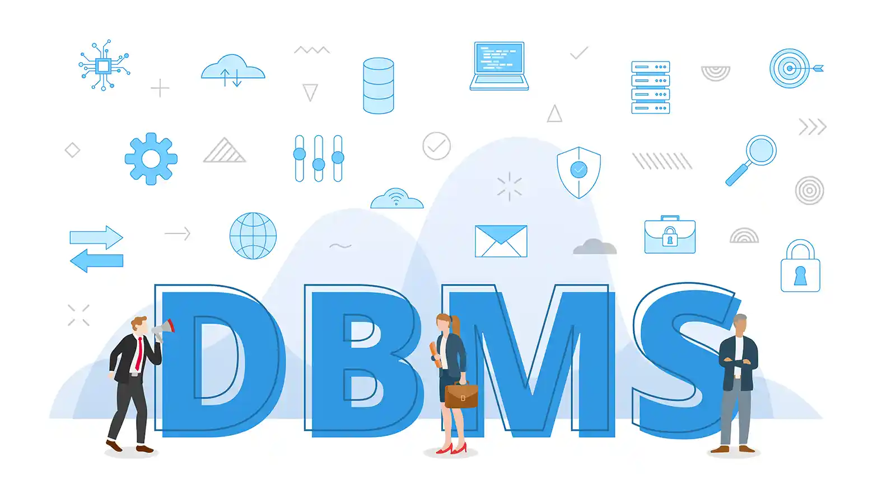
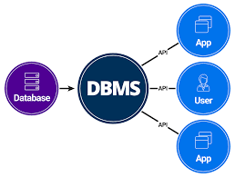
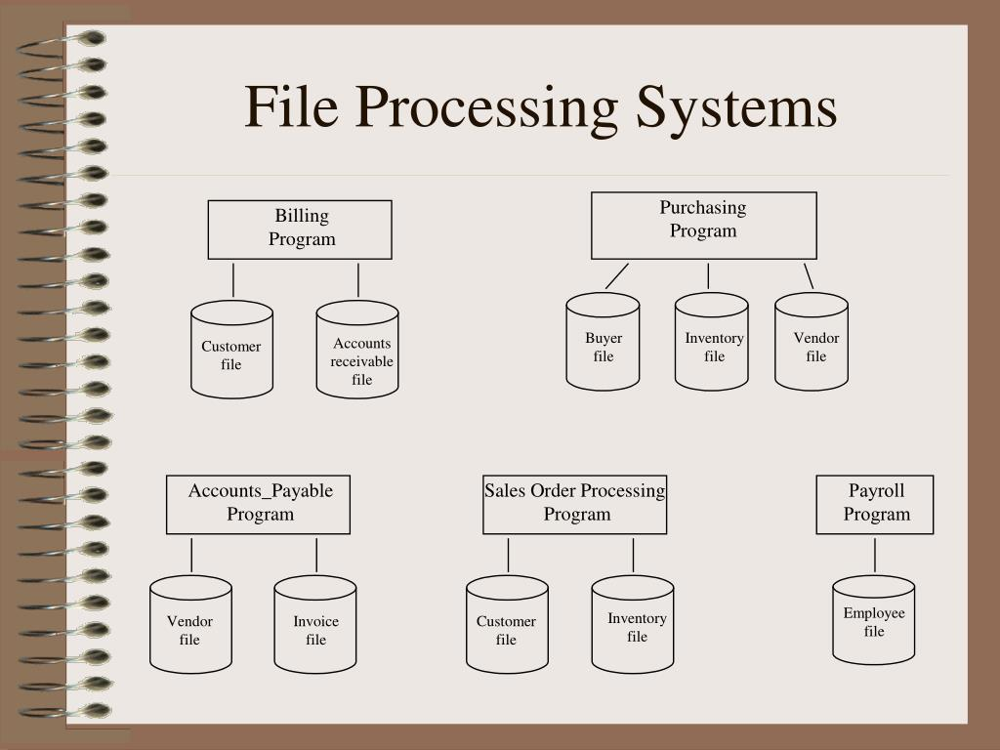
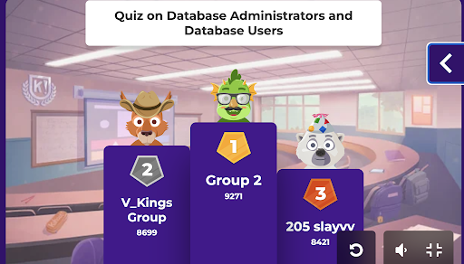
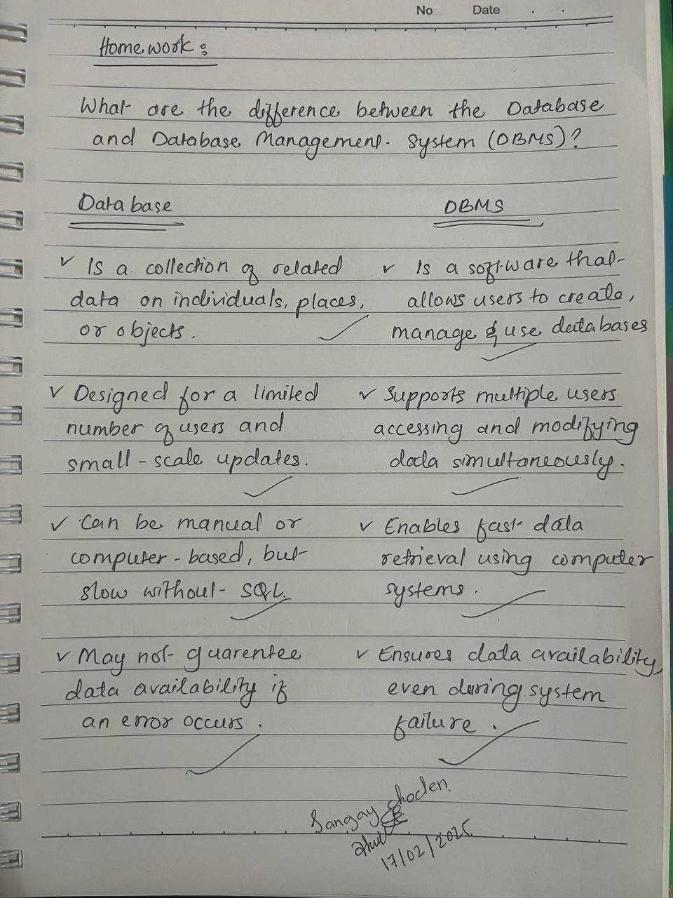

# Topic: Data, Database and Database System

## Learning Objectives:
1. Data and Database.(Lecture-1)
2. Introduction to Data Base Systems.(Lecture-2)
3. Flipped Classroom.
4. Homework.

### **Data & Database:**
- **Data:** Collection of raw facts.
- **Database:** Organized collection of data for easy access & management.
- **DBMS:** Software for storing, managing, and retrieving data efficiently.

**A Database Management System (DBMS) comprises several key components:**

- **Developer:** Designs and maintains the database, ensuring efficiency and security.
- **User:** Interacts with the database to retrieve or input data.
- **Application:** Provides an interface between the user and the database, simplifying access to information.

## file-processing system(Traditional method)
- Stores data in separate files, lacks integration & security.

## Disadvantages of file-processing systems:
1. **Data Redundancy & Inconsistency:** Duplicate data wastes storage and causes inconsistencies.  
2. **Difficulty in Accessing Data:** Lacks efficient querying and indexing.  
3. **Data Isolation:** Separate files hinder data integration and sharing.  
4. **Integrity Issues:** No validation, leading to incorrect or inconsistent data.  
5. **Atomicity Issues:** Incomplete transactions may leave data in an inconsistent state.  
6. **Concurrent Access Anomalies:** Multiple users can cause conflicts and data corruption.  
7. **Security Risks:** Weak access controls, encryption, and auditing make data vulnerable.

## Advantages of DBMS:
1. **Data Consistency:** 
- Centralized updates prevent inconsistencies.
2. **Scalability:** 
- Handles large data & multiple users efficiently.
3. **Security:** 
- Controls access & protects data.
4. **Reduces Redundancy:** 
- Prevents duplicate storage using Normalization.
5. **Data Abstraction:**
- Hides complexity, simplifies access..

## Why Use a Database System?
**Centralized Data Management:** Reduces redundancy & inconsistency.  
**Improved Security:** Protects sensitive data.  
**Efficient Access & Processing:** Fast retrieval & updates.  
**Supports Multiple Users:** Allows concurrent data access.  
**Scalable & Flexible:** Can grow with the organization.  

## Data is the New Gold**  
- In the digital era, **data** is as valuable as gold because it drives decision-making, innovation, and business success.  
- **Database systems** help manage and organize vast amounts of data efficiently.  

## **Brief History of Database Evolution**  
https://palden518.github.io/DBS101.github.io/2024/02/01/unit1.html

2. **Introduction to database system:**

## **View of Data** 
- A **DBMS** supports database creation, querying, updating, and management based on a data model.  
- **Data Model:** Defines the structure, relationships, meaning, and constraints of data.  

## **Types of Data Models**  

1. **Entity-Relationship (ER) Model**  
   - Represents data as **entities (objects) and relationships** between them.  
   - Used in designing **database structures** before implementation. 
   

2. **Semi-structured Data Model**  
   - Stores **irregular or flexible data** formats (e.g., XML, JSON).  
   - Does not follow a strict schema like relational databases.
     

3. **Object-Based Data Model**  
   - Uses **objects (like in OOP)** to store data along with behaviors (methods).  
   - Suitable for **complex applications** like CAD and multimedia databases.
     

4. **Relational Model**  
   - Organizes data in **tables (relations)** with rows and columns.  
   - Uses **SQL** for querying and managing data.
   - data are represented in the form of tables/relations.  
   

## **Data Abstraction** 
- It hides the complexity of data structures from users, allowing easier interaction with the database. 
 
1. **Physical Level:** Defines **how data is stored** internally (e.g., file structures, indexing).  
2. **Logical Level:** Describes **what data is stored** and the **relationships** between them.
3. **View Level:** Shows **only a part of the database**, customized for different users.    

## **Database Design Steps**  
1. **Select a Data Model:** Choose the structure for organizing data.  
2. **Conceptual Design:** Define **functional requirements** and high-level schema.  
3. **Logical Design:** Map the **conceptual schema** to the database system.  
4. **Physical Design:** Optimize **storage and access methods** for performance.  

## **Database Schema vs. Instance.**
- **Schema:** Blueprint/structure of a database.
- **Instance:** Current data in the database.

## **Database Languages**
- **DDL (Data Definition Language):** Defines schema (CREATE, ALTER, DROP).
- **DML (Data Manipulation Language):** Manages data (SELECT, INSERT, UPDATE, DELETE).
- **Query Language:** Retrieves data (SQL).

## Database Engine
- A **database engine** is software in a **DBMS** that manages storage and handles **CRUD** operations (Create, Read, Update, Delete). 
- It is also called a **storage engine** or **embedded database**.  
- **MySQL & MariaDB** allow switching engines.  
- **PostgreSQL** has a fixed built-in engine.

## Database Engine Components  
1. **Storage Manager**: Manages data storage and connects low-level data with applications and queries.  
2. **Query Processor**: Includes **DDL interpreter, DML compiler, and query evaluation engine** to process queries.  
3. **Transaction Management**: Ensures safe and consistent execution of database transactions.

### Database System Architecture:

### Architecture of Applications that use Databases as Backend:

  
### **Flipped Classroom:**

## What are the different types of database users and administrators

## **Types of Database users are:**
1. **Database administrators(DBA):** 
- Manage the database system, set permissions, and ensure security.
- Example: A DBA who manages MySQL databases in an enterprise system.
2. **Appplication Programmers:**
- Developers who write applications that interact with the database.
- Example: A software engineer coding a web app that fetches user data from a database.
3. **End Users:**
- Regular users who interact with the database through applications.
- Consist of Naive and sophisticated User.
- Example: A student using a university portal to check grades.
4. **System Analysts:**
- Design database structures and recommend database technologies.
- Example: An IT specialist designing an inventory database for a company.
5. **Database Designers:**
- Define the database schema (tables, relationships, constraints).
- Example: A designer creating an ER model for a library system.
6. **Data Scientist And Analysts:**
- Extract insights from data stored in databases using SQL queries or analytics tools.
- Example: A data scientist using PostgreSQL to analyze sales trends.
7. **Casual/Temporary Users:**
- Users who occasionally run simple queries without deep technical knowledge.
- Example: A manager checking monthly sales reports in a business database
8. **Specialized Users:**
- They interact with databases using automation, scripts, AI models, or ETL processes instead of manual queries, enabling advanced data processing and analytics. 

## **Key Responsibilities of Database Administrators:**
1. **Database Setup & Configuration:**
- Install, configure, and maintain DBMS.
2. **Security & Access Control:** 
- Manage user permissions and protect data.
3. **Backup & Recovery:** 
- Ensure regular backups and disaster recovery plans.
4. **Performance Optimization:** 
- Tune queries, indexing, and caching for efficiency.
5. **Data Integrity & Consistency:** 
- Maintain accurate and consistent data.
6. **Database Maintenance:** 
- Apply updates, patches, and archive old data.
7. **User Management:** 
- Create and manage database users and roles.
8. **Troubleshooting:** 
- Identify and resolve database errors and slow queries.
9. **Automation & Scripting:** 
- Write scripts for backups and performance monitoring.
10. **Collaboration:** 
- Work with developers and analysts to optimize databases.

### Home work:
- what are the difference between the Database and Database Management System(DBMS)?
