 
# Lesson_3
# Topic:Entity Relationship Model**
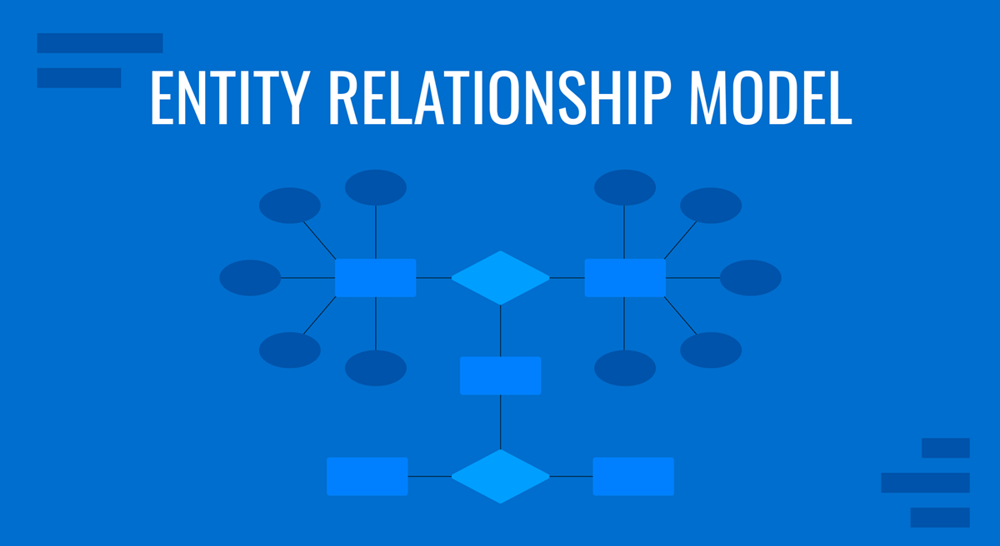
- It is a conceptual data model for database design.

## Learning Objectives:
1. Explain entity relationship diagrams
2. Identify complex attributes.
3. Map cardinalities between entities
4. Determine primary keys in entity sets
5. Remove redundant attributes

## Entity Realtionship Model:
- The ER Model helps to represent a real-world entities and their relationships and provides a blueprint of how datas are organize and connected.
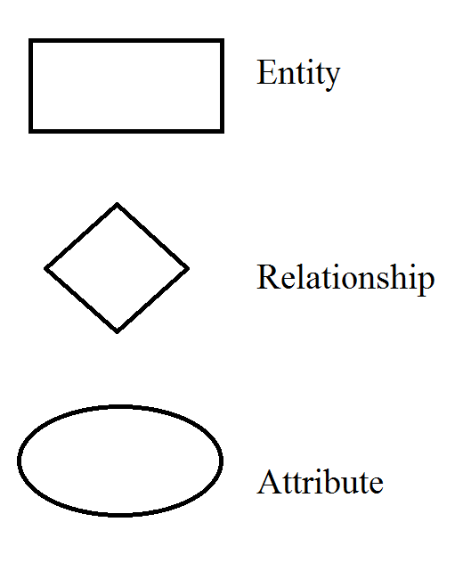
- **Entity:** Is a distinct real-world object (e.g., student)
- **Attribute:** Descriptive property of an entity (e.g., name, age).
- **Relationship:** Association among entities (e.g., student registers for course).

## Types of Attributes:
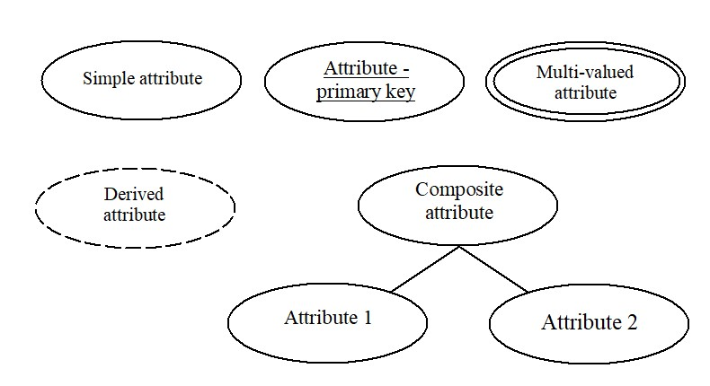
1. **Simple Attributes:** Are those attributes which cannot be divided into subparts.
2. **Composite Attributes:** Are those attributes which can be divided into subparts.
3. **Single-valued Attributes:** Are those attributes which has one value per entity.
4. **Double-valued Attributes:** Are those attributes which has more than one value per entity.
5. **Derived Attributes:** Are those attributes whose value for the attribute
can be derived from the values of other related attributes or entities.

## Types of Relationships:
1. **Binary:** Between two entities.
2. **Ternary:** Involving three entities.
3. **Unary/Recursive:** Entity related to itself.

## Types of Keys:
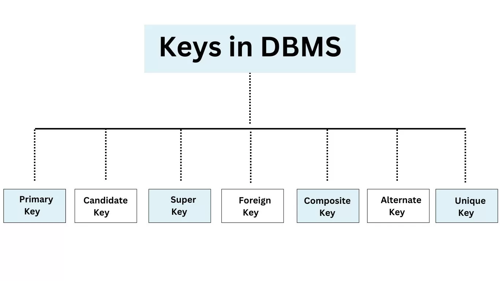
1. **Primary Key:** Unique identifier for entity; underlined in ERD.
2. **Secondary key:** is an attribute used strictly for retrieval purposes.
3. **Super Key:** Any set of attributes that uniquely identifies a record.
4. **Candidate Key:** Minimal super key.
5. **Alternate Key:** Candidate keys not chosen as primary.
6. **Foreign Key:** Refers to a primary key in another table (only in relational models).

## Mapping Cardinalities:
- Mapping cardinalities define how many instances of one entity relate to another in a database.

1. **One-to-One:** Each entity A is related to one entity B.
2. **One-to-Many:** A has many Bs; B has at most one A.
3. **Many-to-One:** Many A to one B.
4. **Many-to-Many:** Many A and many B (e.g., students and classes).

## Crow’s Foot Notation:
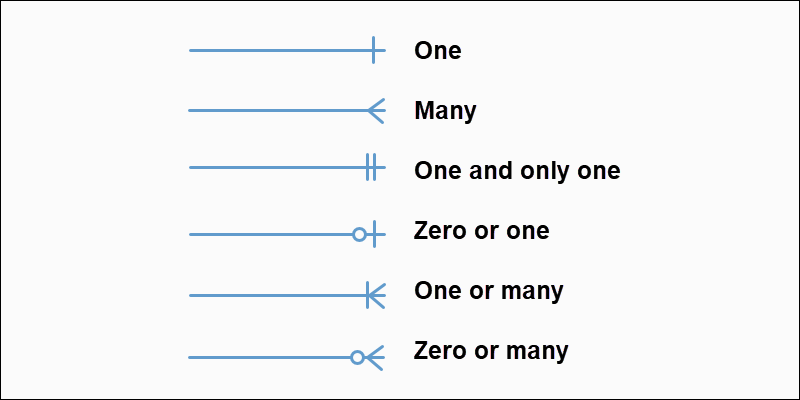

## Weak Entities:
- A **weak entity type** is an entity that lacks a key attribute to uniquely identify its instances within an entity set.
- Needs a foreign key from a related entity.
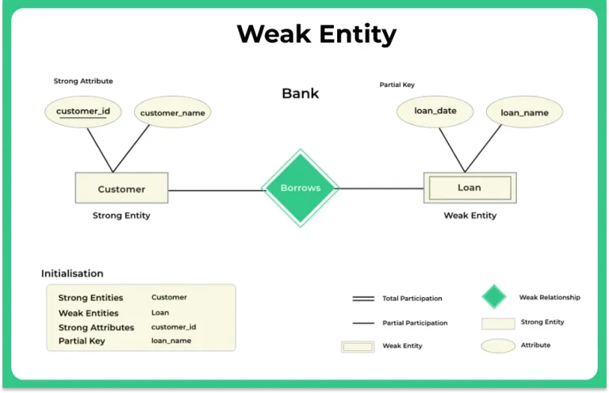

## Homework
**Draw an entity relationship diagram for the student registration system at CST.**
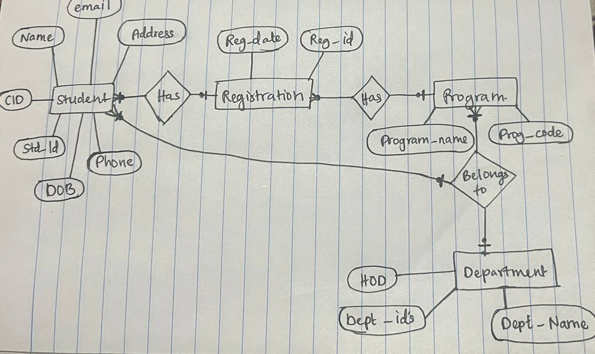

## Redundant Attributes
- Avoid repeating data.
- Ensure each attribute is necessary and non-redundant.

## Extended E-R Feature:
1. **Specialization:** Subgroups of an entity set.
2. **Generalization:** Combine common features of entities.
3. **Attribute Inheritance:** Subclasses inherit attributes of the superclass.
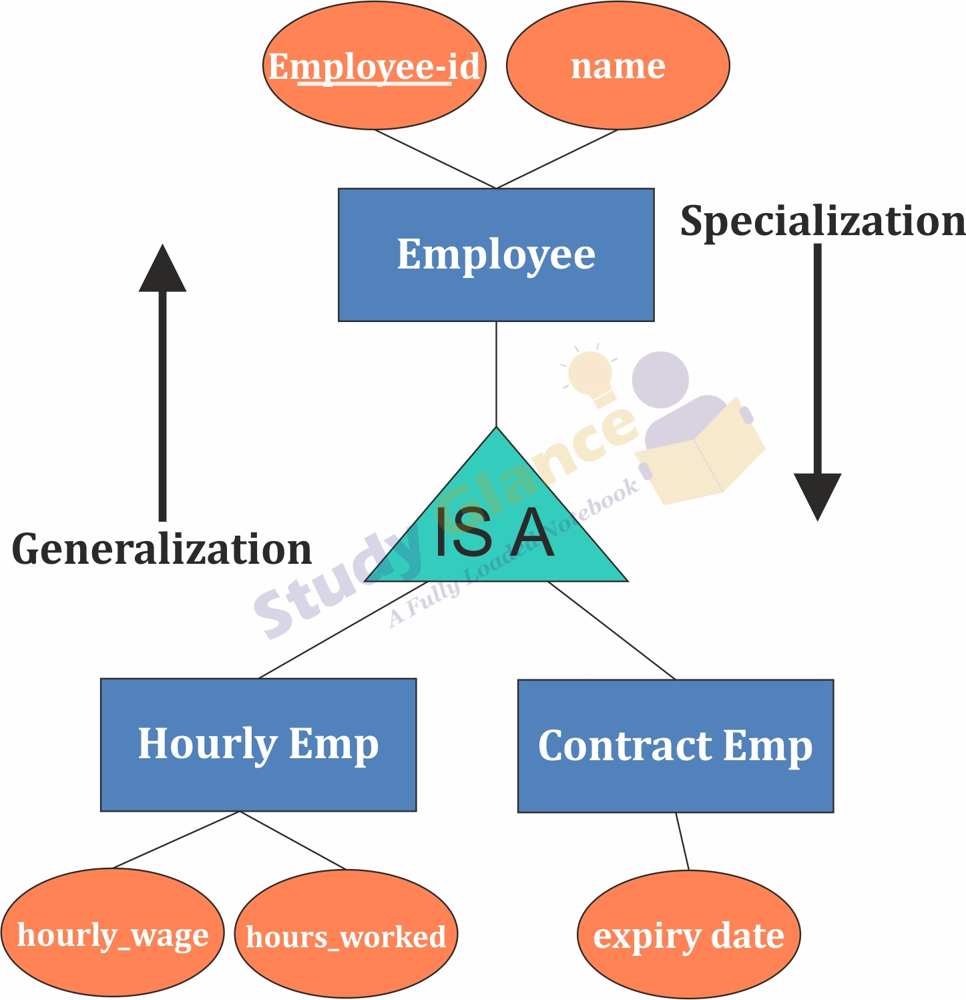

## Constraints
1. **Disjoint vs Overlapping:** Can belong to one or many subclasses.
2. **Total vs Partial:** Must belong to subclass or may not.
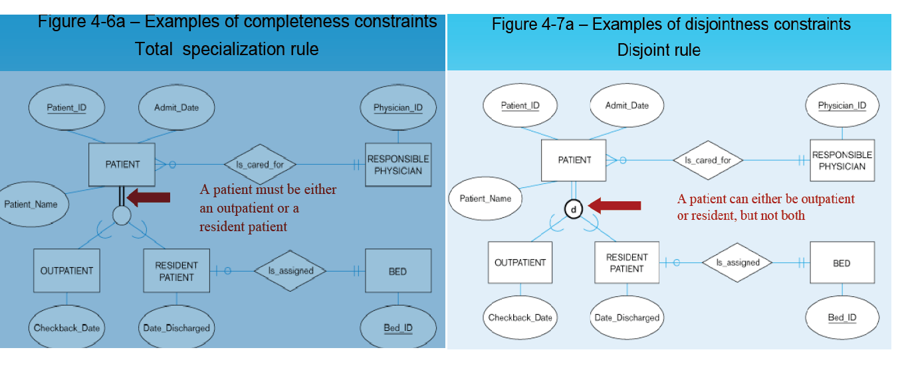

## Aggregation
- Used when a relationship has its own attributes or needs to be part of another relationship.  
- It lets us treat a relationship like an entity.
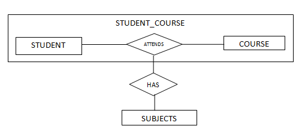

# Lesson_4
# Topic:Relational Model and Schema Design.

## Learning Outcomes
1. Understand the database design process
2. Learn relational data models
3. Explain ER diagrams
4. Identify complex attributes
5. Map cardinalities
6. Determine primary keys
7. Remove redundant attributes

## Relational Model
- **Relational Model** is a way of structuring data using tables, where each table represents a relation. It's the foundation of most modern databases.

## Key Terms:
1. **Relation = Table:** A relation is represented as a table that stores data about a specific type of object (e.g., students, employees, products).
2. **Tuple = Row:** A tuple is a single record in a table. Each row contains data for one instance of the entity.
3. **Attribute = Column:** Attributes are the properties or characteristics of an entity, shown as columns in a table (e.g., name, age, ID).
4. **Database Schema:** Describes the logical design or structure of the entire database. It includes tables, their attributes, and relationships.
5. **Database Instance:** The actual data stored in the database at a particular point in time—like a snapshot of the current content.

## Structure of a Relation
- A relation is an unordered set of tuples.
- Tuples contain atomic values (indivisible).
- **NULL:** Represents missing or unknown values.
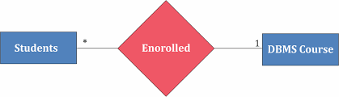

## Keys in Relational Model
1. **Primary Key:** Uniquely identifies each row (e.g., StudentNo).

2. **Foreign Key:** Refers to the primary key in another table.

3. **Super Key:** Any set of attributes that uniquely identifies a tuple.
4. **Candidate Key:** A minimal super key (no extra attribute).
- Primary Key is selected from candidate keys.

## Relational Model Constraints
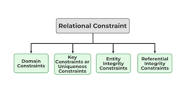

## Schema Design
- Involves connecting tables using relationships.
- Example: 
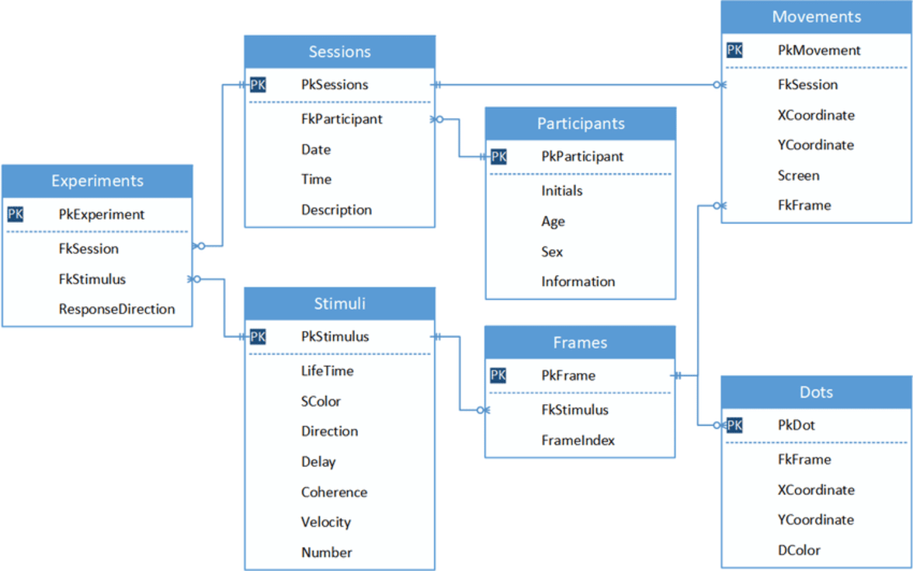

# Lesson_5
# Topic:ERD to Relational Schema
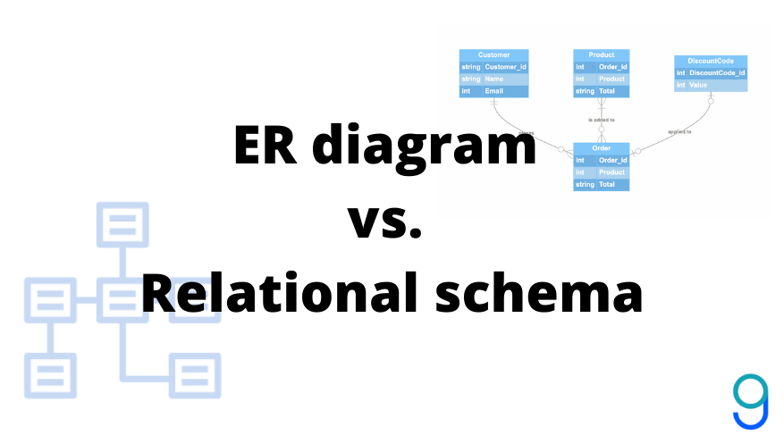

## Converting E-R Diagrams to Relational Schemas
1. **Entity Conversion:**
- Create a table for each type of entity.
- Single-valued attributes → Columns.
- Primary key attributes → Primary key for the table.
- Multivalued attributes → Separate tables.
- Composite attributes → Only sub-attributes become columns.
- Derived attributes → Excluded from the schema.

2. **Relationship Conversion:**
- Each relationship set → A relation (table).
- Attributes: Union of primary keys of participating entities.
- Include any descriptive attributes of the relationship.

3. **Cardinality Rules:**

- **1:1 Relationship:**
* If one side is partial, it takes the foreign key of the total side.
* If both sides are equal, either side can take the foreign key.

- **1: N Relationship:**
* The "many" sides gets its primary key as a foreign key in the "one" side’s table.

- **M: N Relationship:**
* A new relation/table is created with a composite primary key from the two entities.

- **Unary Relationship (Self-Referencing):**
* 1:1 - Can reference the same table using foreign keys in either direction or both.
* 1: N - Recursive foreign keys reference the same relation.
* M: N - A new table is created with composite keys referencing the entity.

4. **Ternary Relationships (3+ Entities):**
- A new table is required.
- The primary keys of all participating entities form the composite primary key.

## Specialization and Generalization

1.	**Mapping Techniques:**
- **Method 1:** Each entity in the hierarchy gets its own table.
- **Method 2:** Only subclasses have tables (with duplicated superclass attributes). Ideal for disjoint and complete inheritance.
- **Method 3:** Only the superclass gets a table. Subclass attributes are included but may lead to null values.

2. **Aggregations:**
- No additional tables are needed for aggregation; attributes are merged into relevant relations.

## Design Guidelines
1.	**Entities vs. Attributes:**
- Treat as an entity if additional information may need storage.
2.	**Entities vs. Relationships:**
- Use relationships for actions between entities.
- Simpler to represent complexity.use binary relationships, though n-ary relationships can sometimes better 

## Unified Modeling Language (UML)
- UML helps model software systems beyond data, including user interactions, functional modules, etc.
- Common UML diagrams: 
* Class diagrams.
* Use case diagrams.
* Activity diagrams.
* Implementation diagrams.

# Lesson_6

## Relational Query Languages
- Are the languages used by users to request information from a database.

## Types:
1.	**Imperative:** Specific step-by-step instructions are given.
2.	**Functional:** Queries are formed by evaluating functions that operate on the database.
3.	**Declarative:** Focus on describing the desired result rather than specifying steps.

## Relational Algebra Basics
- A functional query language forming the theoretical basis for SQL and relational databases.

## Types of Operations:
1. **Unary:** Operate on a single relation. 
- **Select:** Filters tuples based on conditions.
- **Projection:** Chooses specific attributes, rearranges or eliminates unnecessary attributes.
2. **Binary:** Operate on two relations. 
- **Union:** Combines tuples from both relations.
- **Intersection:** Finds common tuples in both relations.
- **Difference:** Finds tuples in the first relation that are not in the second.
- **Cartesian Product:** Generates all possible combinations of tuples.
- **Join:** Combines tuples based on a common attribute between two relations.

## **Key Relational Algebra Operators:**

1. **Select (σ):**
- Filters tuples meeting a condition (predicate).
- **Syntax:** σ_condition(Relation)
- **Example:** Retrieve students with ID 12345.

2. **Projection (π):**
- Extracts specific attributes from a relation.
- **Syntax:** π_attributes(Relation)
- **Example:** Retrieve the names and IDs of students.

3. **Union (U):**
- Combines tuples from two relations, removing duplicates.
- **Example:** Combine data from two student relations.

4. **Intersection (∩):**
- Retrieves tuples common to both relations.
- **Example:** Find students appearing in both datasets.

5. **Difference (-):**
- Retrieves tuples in the first relation but not in the second.
- **Example:** Find students in one relation but not in another.

6. **Cartesian Product (×):**
- Combines tuples from two relations into all possible pairs.
- **Example:** Pair student data with department data.

7. **Join:**
- Combines tuples from two relations with matching attribute values.
- **Syntax:** Relation1 ⋈_condition Relation2

## Operands and Logical Operators:
- **Logical operators used in conditions:**
* ∧ (AND)
* ∨ (OR)
* ¬ (NOT)
* , <, = (comparisons)

## Additional Relational Algebra Operators:
- **Rename (ρ):** Renames relations or attributes for clarity.
- **Assignment (←):** Assigns a relation to a variable.
- **Duplicate Elimination:** Ensures uniqueness of tuples.
- **Aggregation (Σ):** Performs calculations like sum, average, etc.
- **Sorting (τ):** Orders tuples based on specified attributes.
- **Division:** Matches tuples in one relation to tuples covering all combinations in another.