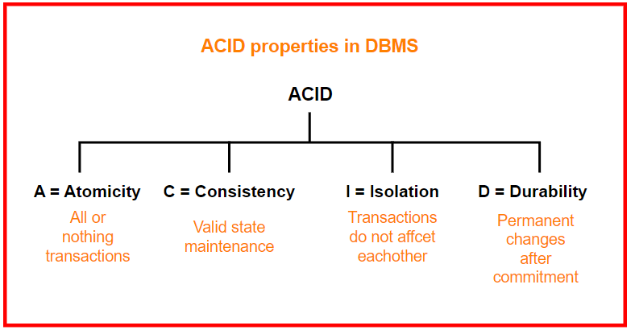

## **Learning Objectives**
- Understand and explain ACID properties for transactions.
- Use SQL to define, modify, and retrieve data.
- Apply constraints to maintain data integrity.
- Work with different SQL data types and schema definitions.
- Use clauses like WHERE, ORDER BY, GROUP BY, HAVING, and nested queries.
- Perform advanced SQL tasks like window functions, subqueries, and aggregate functions.
- Modify existing databases by inserting, deleting, updating data, and altering structures.

## **Lesson 6: Fundamentals of SQL and Database Transactions**

## **ACID Properties:**
1. **Atomicity:** All steps in a transaction happen or none.
2. **Consistency:** DB remains in a valid state before and after transaction.
3. **Isolation:** Transactions operate independently.
4. **Durability:** Once a transaction is committed, it stays so.

## **History of SQL**
- Originally called SEQUEL.
- Developed by IBM in the 1970s during the System R project.

## **What is System R Project?
- **System R** was a landmark project that established the foundation for relational databases and the SQL language.
- It was Initiated by IBM in the 1970s.
- Its **Objective** was To develop a relational database management system (RDBMS) based on Edgar F. Codd's **relational model**.

## **Parts of SQL**
- DDL (Data Definition)
- DML (Data Manipulation)
- Integrity
- View Definition
- Transaction Control
- Embedded SQL and dynamic SQL
- Authorization

## **SQL Data Types**
- Numeric: INT, FLOAT, REAL, NUMERIC(4,2)
- Character: CHAR(n), VARCHAR(n)
- Special: DATE, TIMESTAMP, BOOLEAN, BIT

## **Constraints**
- NOT NULL, UNIQUE, PRIMARY KEY, FOREIGN KEY, CHECK, DEFAULT, INDEX
**Schema Definition Example:**

**SQL Queries:**

## **PostgreSQL Terminal Commands:**
- \l: list databases
- \c dbname: connect to database
- \dt: show tables
- \d+ tablename: show columns

## **Lesson 7: Basic SQL Operations and Table Alteration**

## **SELECT Statements**
- SELECT * FROM table
- SELECT column1, column2 FROM table WHERE condition

## **WHERE Clause**
- **Logical Operators:** AND, OR, NOT
- **Ordering:** ORDER BY column [ASC|DESC]

## **Joining Tables**

## **Table Modifications**

## **LIKE and AS**

## **Deleting Data and Tables**

## **Lesson 8: Advanced SQL – NULL Handling, Aggregates & Subqueries**

## **NULL Values**
- IS NULL, IS NOT NULL
- Affects arithmetic & logical operations.
- SQL uses 3-valued logic: TRUE, FALSE, UNKNOWN

## **Aggregate Functions**

## **GROUP BY and HAVING**

## **Nested Subqueries**

## **Set Membership and Comparison**
- IN, NOT IN, ALL, ANY, EXISTS
## **WITH Clause (CTE)**
.png)

## Scalar Subqueries
- Used where a single value is expected (e.g. in SELECT, WHERE, or SET clauses).
## **Window Functions**
- Used for ranking and analytical calculations without collapsing rows.

## Conclusion
- These three lessons form the backbone of working with relational databases. Understanding how to structure SQL commands, manage transactions with ACID principles, and apply both basic and advanced queries enables efficient, reliable data handling. Whether you're working on a simple database or a large-scale application, mastering these SQL concepts is essential for becoming a proficient database developer or analyst.