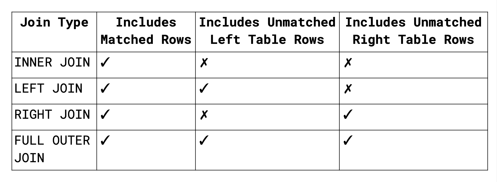
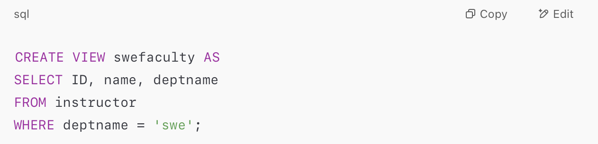
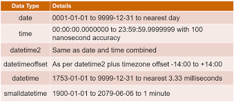
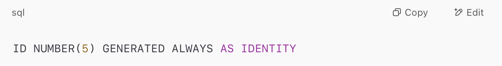
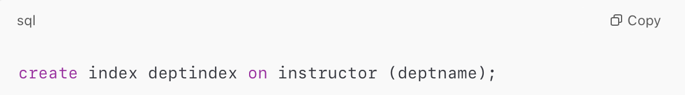
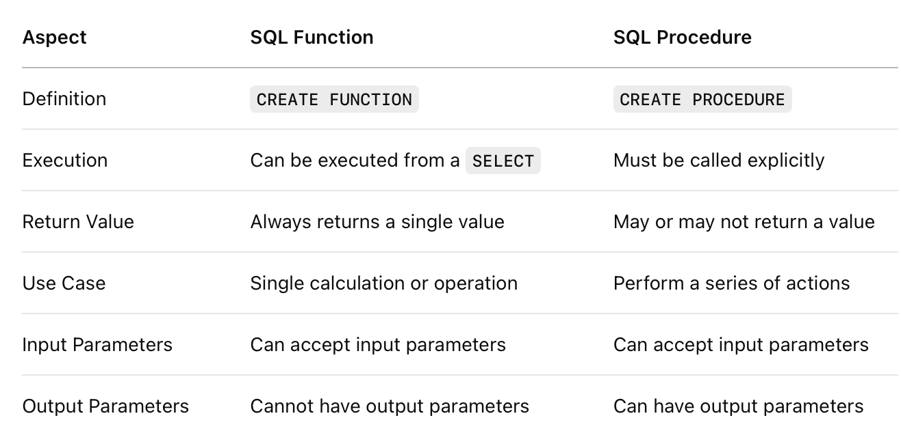

# Topic: Advanced SQL Concepts and Data Access Control

## Learning Objectives:
1. SQL Joins & Views
2. Data Integrity & Constraints
3. Indexing & Optimization
4. Authorization & Access Control
5. SQL Integration with Programming Languages
6. Stored Logic
7. Recursive Queries & Advanced Aggregation

# Lesson_9

## Join Expressions:

1. **Natural Join:**
- Performs Cartesian product, filters consistent tuples
- Removes duplicate attributes
- Requires at least one common column

2. **Inner Join:**
- Default type of join
- Returns only matched tuples

3. **Outer Join:**
- Returns matched and unmatched rows
- Inserts NULL for missing values

## Types of outer joins:
1. **LEFT JOIN:** Includes unmatched rows from the left table
2. **RIGHT JOIN:** Includes unmatched rows from the right table
3. **FULL OUTER JOIN:** Includes unmatched rows from both tables

## SQL Views
- **View:** A virtual table based on the result of a query
- **Used to:**
* Simplify complex queries
* Control data access (authorization)
* Format data presentation

## Materialized Views
- Physically stores view data
- Automatically updated when base tables change (view maintenance)

## Updatable Views:
- One table only in FROM
- No aggregates, expressions, or DISTINCT
- No GROUP BY or HAVING
- Non-selected attributes can be null

## Integrity Constraints
- Ensure data consistency:
1. **Entity Integrity:** No primary key is null
2. **Domain Constraints:** Data must belong to a specific domain
3. **Referential Integrity:** Foreign keys must match primary keys
4. **Key Constraints:** Uniqueness of keys

# SQL Data Types & Schemas
## Date/Time Types
- Support for different timestamp and interval formats

## Large Object Types
- Used for storing multimedia or large text.

### large-object data types:
- **clob:** character large objects
- **blob:** binary large objects

## PostgreSQL Equivalents:
- BYTEA (<1MB)
- TEXT (<1GB)
- Large Object (<4TB)
- JSONB, XML (<1GB)

## User-Defined Types
- SQL supports two forms of user-defined data types:

1. **Distinct Types**
- Custom data types derived from existing SQL types.
- They help make code more readable and semantically meaningful.
- Cannot be implicitly converted to/from base type (ensures type safety).

2. **Structured Types**
- Allow creation of complex data types.
- Can include:
- Nested records
- Arrays
- Multisets
- Useful for object-relational database systems (not covered in depth here).

## Domains
- A domain is a user-defined type with constraints on allowable values.
Helps apply consistent validation rules across multiple tables/columns.

## Use Case:
- Instead of repeating a constraint everywhere, define it once in a domain.

## Benefits:
- Centralized constraint management
- Improved readability
- Easier maintenance

## Generating Unique Key Values
- Modern database systems can automatically generate unique identifiers using identity columns.
**Example:**

- Automatically increments the value when a new row is inserted.
- Ensures that each row has a unique primary key.

# Lesson_10

## Schemas, Catalogs, and Environments
- **Hierarchical Structure:** Modern DBMS use catalogs → schemas → relations
- **User Access:** Users connect with a username/password and are assigned a default schema
- **Three-Part Naming:**
**Format** → catalog.schema.relation
**Example** → EHRDB.public.Patient
- **Schema Management:** Schemas can be created/dropped via SQL. Catalogs are system-specific.

## Schema Vs Databases:

## Indexes in SQL
- An index is a data structure that helps efficiently find tuples in a relation based on specified attribute values without scanning the entire relation.
- **Creating an Index:**

- **Unique Index:** To declare that the search key is a candidate key.

- **Deleting an Index:**

## Authorization in SQL
- **Privileges:** SQL authorizations can grant read, insert, update, and delete privileges on data.
- **Select:** Required to read data.
- **Update:** Allows modification of data in the relation.
- **Insert:** Allows inserting new data into the relation.
- **Delete:** Allows removing data from the relation.
- **Execute:** Allows executing functions or procedures.
- **Grant Statement:** Used to confer authorization.
- **Revoke Authorization:** The revoke command is used to revoke privileges from a user/role.

## Roles and Views
- **Authorization on Roles:** Privileges can be granted to roles, and these roles can be granted to other roles or users.
- **Authorization on Views:** Users who create a view do not automatically receive privileges on the view itself.
- **Authorization on Schemas:** Only the owner of a schema can modify it. There are specific privileges for declaring foreign keys in a schema.

## Accessing SQL from a Programming Language
- **Reasons:** SQL alone lacks expressiveness for complex queries or non-declarative actions such as user interaction or report generation, necessitating integration with general-purpose programming languages.

- **Approaches:** 
1. **Dynamic SQL:** Allows programs to construct SQL queries as strings during runtime. Common standards for connecting are JDBC (Java) and ODBC.
2. **Embedded SQL:** SQL statements are embedded in a general-purpose program and processed at compile time.

## Key Tools for Database Integration
- **JDBC (Java Database Connectivity):** API for Java programs to interact with database servers.
- **ODBC (Open Database Connectivity):** API for applications to connect to databases, send queries, and retrieve results.

# Lesson_11

## Functions and Procedures in SQL
- **Definition:** Functions and procedures are blocks of code written to perform specific tasks and define business logic in the database.
- **SQL Functions:** Can be defined using the CREATE FUNCTION statement. They can be executed from within a SELECT statement or another function and always return a single value.
- **SQL Procedures:** Defined using the CREATE PROCEDURE statement. Must be explicitly called using the EXECUTE statement or another procedure. They can perform multiple actions and may or may not return a value.

## Differences between SQL Functions and Procedures:

## Language Constructs for Procedures and Functions
- SQL supports constructs like declare, for, and control-flow statements, allowing for greater flexibility in stored procedures and functions.

## External Language Routines
- Functions defined in external programming languages like Java, C, and Python can be executed within the database system, but this introduces risks, such as bugs corrupting internal database structures.

- **Some database systems allow for external language routines to run in a sandbox environment:**
1. Oracle and IBM DB2 support Java.
2. Microsoft SQL Server supports CLR (Common Language Runtime).
3. PostgreSQL allows languages like Perl, Python, and Tcl.

## Triggers in SQL
- **Definition:** A trigger is an automatic action executed in response to a modification in the database.
- **Use Cases:** Triggers are used to enforce integrity constraints, alert humans, or automatically start tasks when specific conditions are met (e.g., updating related data or automatically placing orders).
- **Limitations:** Triggers cannot perform updates outside the database. They are primarily used for database-level changes.

## When Not to Use Triggers:
- **Replication Issues:** Avoid using triggers when dealing with database replication or backup sites, as they could cause unintended actions.
- **Runtime Errors:** Triggers should be written carefully to avoid errors or infinite chains of triggering.
- **Complex Logic:** For more control, consider using stored procedures instead of triggers.

# Lesson_12

## Recursion in SQL
- **Definition:** Recursion in SQL allows a query to reference its previous results repeatedly until it returns an empty result. It is useful for working with hierarchical data, such as organization charts or family trees.
- **Recursive SQL Common Table Expressions (CTEs):** These are created using a WITH statement, which allows the query to reference itself.

## Transitive Closure:
- The transitive closure concept can be defined as:
If (a1, a2) ∈ R and (a2, a3) ∈ R, then (a1, a3) ∈ R.
- Recursive queries can be used to express transitive closures efficiently in SQL.

## Recursive Queries:
- Recursive queries in SQL are written using the WITH RECURSIVE clause. A recursive query consists of two parts:
1. **Base query:** A non-recursive part of the query that provides the initial result set.
2. **Recursive query:** References the recursive view to continue processing.

## Restrictions on Recursive Queries:
- Recursive queries must be monotonic, meaning the recursive step should always move toward termination and never loop indefinitely.

- **Restrictions include:**
1. No aggregation on the recursive view.
2. No NOT EXISTS in subqueries using the recursive view.
3. No set difference (EXCEPT) where the right-hand side uses the recursive view.

## Advanced Aggregation Functions
- Advanced aggregation techniques, such as window functions, ranking functions, and others, are typically covered under this topic. These techniques are used to perform more complex operations like ranking, running totals, and complex groupings.

# Conclusion:
- This unit explored advanced SQL concepts, including various types of SQL joins and views that simplify complex queries and control data access. We also covered important data integrity constraints, indexing, and optimization techniques for ensuring data consistency and improving query performance.
- Additionally, we delved into authorization and access control, learning how to manage user privileges and roles, and how to integrate SQL with programming languages like Java and Python. Stored logic, including functions, procedures, and triggers, was also discussed, highlighting their role in automating tasks and enforcing integrity rules within the database.
- Furthermore, recursion in SQL and advanced aggregation functions were introduced to handle hierarchical data and perform complex operations like ranking and running totals. Overall, this unit provided a comprehensive understanding of advanced SQL operations, database management, and data access control essential for effective database design and querying.