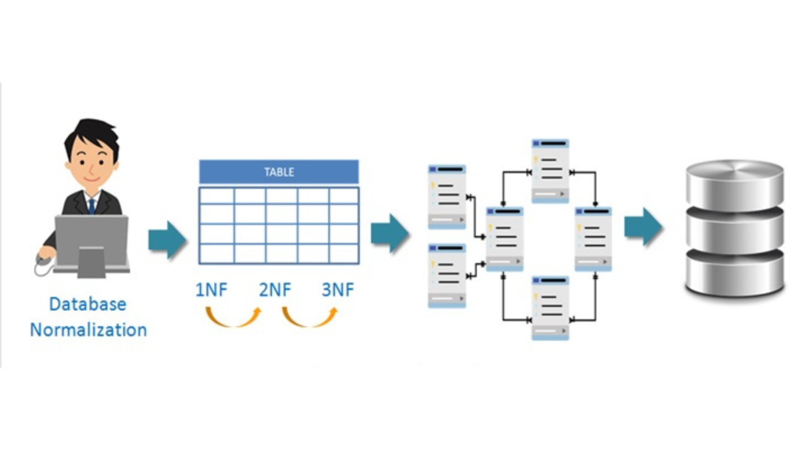

# Topic: Advanced Database Normalization and Design Principles

## Learning Objectives:
1. Understand principles of good relational database design, focusing on minimizing null values, redundancy, and modification anomalies.
2. Apply normalization techniques up to BCNF, 4NF, and 5NF to achieve efficient database structures.
3. Decompose schemas using functional and multivalued dependencies while ensuring lossless and dependency-preserving designs.
4. Utilize functional dependency theory, including attribute closure and canonical cover, in database refinement.
5. Ensure attribute atomicity and compliance with First Normal Form (1NF).
6. Follow systematic database design processes, integrating E-R modeling with normalization techniques.
7. Model temporal data by managing valid time periods and maintaining consistency in temporal relations.

# Lesson_12
# Topic: Database Design and Normalization

## Features of Good Relational Designs:

1. **Relation for Every Entity:**
- Each tuple should represent one entity or relationship.
- Attributes should be kept separate for different entities.
- Foreign keys are used to refer to other entities.

2. **Lesser Number of Null Values:**
- Design relations to minimize NULL values.
- Frequently NULL attributes can be stored in separate relations.

3. **No Spurious Tuples (Decomposition):**
- Bad designs may result in incorrect JOIN operations.
- A lossless join property should guarantee meaningful results.

4. **No Redundancy:**
- Redundancy can lead to issues like extra storage, inconsistent data, and anomalies in updates.

5. **No Modification Anomaly:**
- **Types of anomalies include:**
- **Update Anomaly:** Inconsistencies when updating data in multiple places.
- **Deletion Anomaly:** Loss of related data during deletions.
- **Insertion Anomaly:** Restrictions when inserting data without related information.

## Normalization:
- Normalization reduces redundancy and ensures efficient data retrieval.
- Normal forms (1NF, 2NF, 3NF, BCNF) aim to eliminate redundancies and anomalies.
- **Functional Dependency:** Describes the relationship between attributes. A set of functional dependencies is used to identify schema normalization.
- **Decomposition:** Splitting relations to avoid redundancy and anomalies while preserving dependencies.

# Lesson_13
# Topic: Advanced Normalization and Temporal Data

## Multivalued Dependencies (MVDs)
- Even if a schema is in BCNF, redundancy may still exist.
- **Example:** inst(ID, dept_name, name, street, city) — if instructors have multiple departments and addresses → redundancy.
- A Multivalued Dependency X →→ Y holds if for each X, the set of Y values is independent of other attributes.

## 4NF (Fourth Normal Form):
- A schema is in 4NF if, for every non-trivial MVD X →→ Y, X is a superkey.
- **Fixing redundancy:** Decompose into separate relations.
- **From inst(ID, dept_name, street, city) → split into:**
* r1(ID, name)
* r2(ID, street, city)

## More Normal Forms

1. **5NF / PJNF (Project-Join Normal Form):**
- Generalizes multivalued dependencies.
- Eliminates redundancies not captured by 4NF.

2. **DKNF (Domain-Key Normal Form):**
- Based on general constraints beyond FDs and MVDs.
- Not practical due to complexity (no complete inference rules).

## Atomic Domains & 1NF

### In 1NF, all attributes must be atomic:**
- Indivisible; no internal structure.

### Non-atomic examples:**
- **Composite attributes:** address (street, city, state)
- **Multivalued attributes:** phone_numbers
- **Encoded values:** employee_ID = "HR045" (where "HR" encodes dept)

## Why atomicity matters:
- Reduces redundancy
- Prevents inconsistency
- Easier querying and indexing

## Fix:
- Split composite values into individual attributes.
- Avoid multivalued fields.

## Database Design Process
- **Design can start from:**
1. **E-R Diagram:** Best if well-designed.
2. **Single schema:** Normalize after initial design.
3. **Ad-hoc schema:** Normalize iteratively.

## Good practices:
- Use meaningful names (avoid vague terms)
- Ensure unique role of each attribute
- List keys first in schema
- Normalize early, denormalize only when needed for performance

## Modeling Temporal Data

## What is temporal data?
- Data valid over a specific time period.
- **Example:** A course might have different titles in different years.

## How to handle it:
- Add start_date, end_date columns.
- Avoid overlapping time intervals for the same entity.

**Example:**

- When data changes → insert new row with new valid period.
- Functional dependencies may only hold within a snapshot in time.

## Temporal Keys & FKs:
- Primary keys should include time (e.g. (course_id, valid_period))
- Temporal foreign keys must validate across time ranges

# Conclusion:
- From these lessons, I’ve learned how important proper database design is for keeping data clean, consistent, and easy to manage. I now understand how normalization helps remove unnecessary data and avoid problems like update, delete, and insert anomalies.
- Learning about different normal forms like 1NF, BCNF, and 4NF, along with concepts like functional and multivalued dependencies, gave me a clear idea of how to improve database structure. I also found it interesting how temporal data is handled using time periods.
- Overall, this unit helped me build a strong foundation in designing better and more efficient databases.