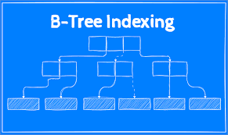
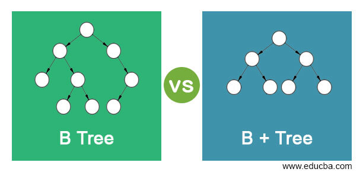

# Lesson 14
## Indexing and B-Tree Family

## Objectives:
- Understand types of indexing.
- Implement multilevel indexing.
- Learn about the B-tree family of data structures.

## What are the indexes?
- Data structures used to speed up query/data retrieval.
- Without indexes, full table scans are needed (very slow for large data).

## Types of indexes:
1. **Ordered Indexes**
- Store search keys in sorted order.
- **Clustering Index:** data sorted same as index.
- **Non-Clustering Index:** data not sorted same as index.
**Subtypes:**
1. **Dense:** one index entry for each record.
2. **Sparse:** one entry per block or few records (requires clustering).

2. **Hashed Indexes**
- Use a hash function to map search keys to buckets.
- Fast for equality searches, but not good for range queries.

## Multilevel Indexing
- Used when index is too large for memory.
**Involves:**
1. Inner index (on disk).
2. Outer index (in memory) pointing to inner index.

## Secondary Indexes
- Built on non-primary key attributes.
- Useful when frequent queries are made on non-key fields.

## B-Tree and B+ Tree
- B-Tree: Balanced search tree; stores keys and data in all nodes.
 **B+ Tree:**
1. Only leaf nodes store actual data.
2. Inner nodes are used for search guidance.
3. Better for range and sequential queries.

## Hashing and Hash Indexes
- Uses buckets and chaining to resolve collisions.
- Ideal for exact matches, not for range queries.
**Static vs Dynamic Hashing:**
1. **Static:** fixed number of buckets.
2. **Dynamic:** buckets grow dynamically (e.g., linear hashing).

##  Conclusion:
- Indexing is essential for performance in databases.
- Choose index type (ordered vs hashed) based on query needs.
- B+ Trees are widely used due to balance and support for ranges.

# Lesson 15
## Query Processing and Optimization

## Objectives:
- Understand the process of query handling.
- Learn how to evaluate and optimize queries.
- Calculate query evaluation costs.

## Query Processing Steps
1. **Parsing & Translation**
- SQL → relational algebra (logical plan).
2. **Evaluation**
- Choose and execute physical plan.
3. **Optimization**
- Select most efficient plan based on cost.

## Evaluation Techniques
- **Relational Algebra:** Used for internal query representation.
- **Query Plan:** Specifies how to evaluate the query (includes access paths, algorithms).
- **Pipelining:** Pass output of one operation directly to next without storing.
- **Materialization:** Store intermediate results in temporary tables.

## Query Cost Factors:
- Disk I/O (dominant cost in older systems).
- CPU cost (important in memory/SSD systems).
- Buffer availability, data layout, and parallelism also affect cost.

## Join Algorithms
- **Nested-Loop Join:** Compare every tuple.
- **Block Nested-Loop:** Compare block-wise (less costly).
- **Indexed Join:** Use index for faster lookups.
- **Merge Join:** Efficient if inputs are sorted.

## Other Operations
- **Sorting:** Done with external sort-merge for large datasets.
- **Duplicate Elimination:** Use hashing or sorting.
- **Projection, Set Operations, Aggregation, and Outer Join:** Have cost implications based on method used.

## Pipelining vs Materialization
1. **Pipelining:**
- Lower cost.
- Used when intermediate data doesn’t need to be stored.
2. **Materialization:**
- Necessary for operations like sort or when multiple passes are needed.

## Memory & Cache Optimization
- Cache-conscious algorithms improve performance by reducing CPU cache misses.
- Query compilation (instead of interpretation) speeds up execution.

## Conclusion:
- Efficient query processing relies on good optimization.
- Cost models guide the optimizer in choosing the best plan.
- Understanding evaluation strategies and join algorithms helps improve query performance.