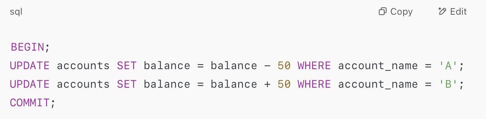

# Unit 7
## Objectives 

- Define transactions and explain ACID properties.
- Use SQL to implement transactions in PostgreSQL.
- Apply locking mechanisms (Shared, Exclusive, 2PL).
- Handle concurrency with timestamp ordering and MVCC.
- Detect and prevent deadlocks.
- Analyze transaction schedules for serializability.
- Understand and implement undo/redo using logs.
- Use checkpoints and write-ahead logging (WAL) for recovery.
- Explain ARIES recovery algorithm (Analysis, Redo, Undo).
- Describe remote backup and high availability strategies.

# Lesson 18
## Topic: Database Transactions and ACID Properties

### What is a Transaction?
- A transaction is a logical unit of work that consists of one or more operations.
- Begins with BEGIN and ends with COMMIT or ROLLBACK.

### ACID Properties
- **Atomicity:** All operations in a transaction are completed, or none are.
- **Consistency:** Ensures the database remains in a valid state.
- **Isolation:** Concurrent transactions appear to be executed in serial order.
- **Durability:** Committed changes persist despite system failures.

### PostgreSQL Example:

### Storage Types:
1. **Volatile:** Fast but lost on crash (e.g., RAM).
2. **Non-Volatile:** Survives crashes (e.g., disks).
3. **Stable:** Redundant, crash-proof storage.

### Transaction States
- Active → Partially Committed → Committed OR Failed → Aborted

###  Transaction Isolation
1. **Serial Schedule:** One transaction at a time.
2. **Non-Serial Schedule:** Concurrent execution.
3. **Schedule:** Equivalent to some serial schedule.

### Conflict Serializability
- **Precedence Graph:** Used to detect conflicts (cycle → not serializable).

### Recoverability
1. **Recoverable Schedule:** Tj commits only after Ti (which it read from).
2. **Cascadeless:** Tj reads only committed values from Ti.

### Isolation Levels
- Serializable → Repeatable Read → Read Committed → Read Uncommitted

# Lesson 19
## Topic: Concurrency Control and Locking

### Purpose of Locks
- Prevents conflicts and ensures isolation in concurrent transactions.

### Lock Modes:
- **S (Shared):** Read only
- **X (Exclusive):** Read & write

### Two-Phase Locking (2PL)
1. **Growing Phase:** Acquire locks.
2. **Shrinking Phase:** Release locks.

### Deadlocks
- **Detection:** Wait-for graph & cycle detection.
- **Prevention:**
1. Wait-Die: Older waits, younger aborts.
2. Wound-Wait: Older aborts younger.

### Lock Granularity
- Tuple → Page → Table
- Finer granularity → more concurrency but more overhead.

### Intention Locks:
- IS: Intend to get shared locks below
- IX: Intend to get exclusive locks below
- SIX: Shared at current + exclusive below

### Lock Escalation
- System automatically replaces many fine-grained locks with a coarser one.

### Concurrency Control Approaches:
1. **Pessimistic:** Prevents conflicts upfront (2PL, Timestamps)
2. **Optimistic:** Detects conflicts at commit time

### Timestamp Ordering
- Based on transaction timestamps.
- Thomas Write Rule allows skipping unnecessary aborts.

### Multi-Version Concurrency Control (MVCC)
- Maintains multiple versions of data for higher concurrency.

# Lesson 20
## Topic: Database Recovery Mechanisms

### Importance of Recovery
- Handles crashes, failures, human errors, and disasters.

### Log-Based Recovery
- Log records all operations.
- **Log format:** <Ti, Xj, old_value, new_value>, <Ti start>, <Ti commit>, <Ti abort>

### Database Modification Techniques
- **Deferred:** Updates at commit.
- **Immediate:** Updates during execution; needs undo/redo.

### Undo and Redo
- **Undo:**	Revert uncommitted changes.
- **Redo:**	Reapply committed changes.

### Checkpoints
- Saves state of the system.
- Reduces the amount of log needed during recovery.
- Fuzzy Checkpoints allow ongoing transactions.

### Write-Ahead Logging (WAL)
- Log changes before writing to disk.

### ARIES Algorithm
- **Analysis:** Identify active transactions & dirty pages.
- **Redo:** Repeat history.
- **Undo:** Roll back incomplete transactions.

### Main-Memory Database Recovery
- Uses optimized logging & parallel recovery.
- Avoids full redo for indexes.

### High Availability
- **Remote Backup:** Ship logs to secondary site.
- **Failover Systems:** Automatic switchover in failure.

## Conclusion
- Unit 7 helped me understand the core concepts of transaction processing, concurrency control, and database recovery. I learned how important it is to maintain data consistency and integrity, especially when multiple transactions are happening at the same time or when failures occur. Concepts like ACID properties, locking mechanisms, deadlock handling, and ARIES recovery gave me practical insight into how databases handle complex situations. Overall, this unit has strengthened my foundation in building reliable and fault-tolerant systems, which I believe is essential for any future work in software or data engineering.